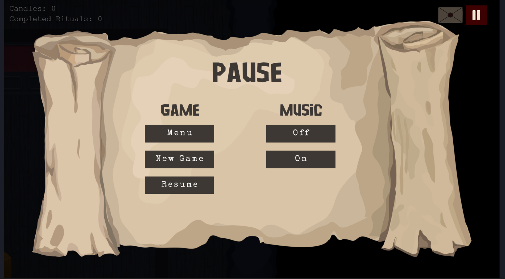
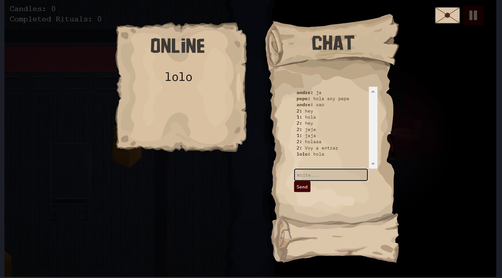
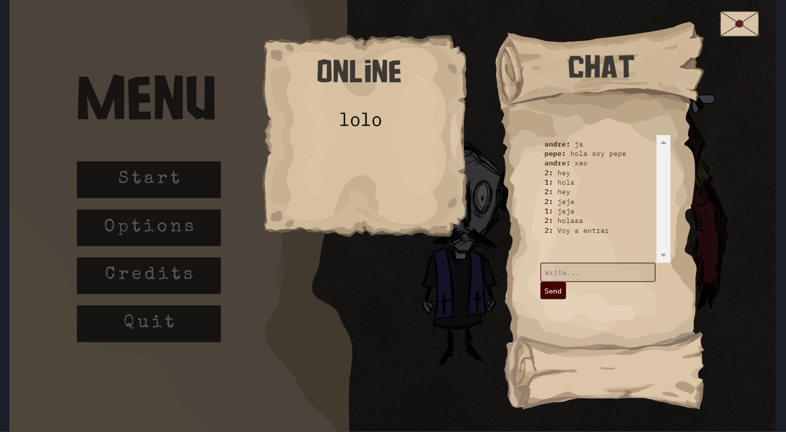

# Mejoras The Last Candle

**Desarrolladores - Grupo 10:**
- Javier Álvarez Pérez - j.alvarezp.2020@alumnos.urjc.es - https://github.com/JavierAlper
- Lucas García Marcos - l.garciamarc.2021@alumnos.urjc.es - https://github.com/Lololeifo
- Laura García Martín - l.garciamar.2021@alumnos.urjc.es - https://github.com/laurennthx 
- Cristina González De Lope - c.gonzalezde.2022@alumnos.urjc.es - https://github.com/crisstinagl
- André Miguel Pérez Sánchez - am.perezs.2021@alumnos.urjc.es - https://github.com/andremip

**Repositorio GitHub:**
- https://github.com/Laurennthx/TheLastCandleAPIREST
- https://github.com/Laurennthx/TheLastCandle

---

## Mejoras realizadas
En este documento se detalla las mejoras realizadas sobre nuestro proyecto de prácticas para la asignatura de juegos en red: ‘The Last Candle’.

### Menú de Pausa
Se ha implementado un menú de pausa al que acceder durante el transcurso de la partida. Desde este menú se puede apagar o encender la música, crear una nueva partida, ir al menú o reanudar la partida. Mientras está abierto el menú de pausa los personajes no pueden moverse ni interactuar en el caso de una partida local. En el caso de una partida online, solo se congela el personaje del usuario que tiene abierto el menú de pausa.

### Chat y online
Se ha implementado un chat en tiempo real al que se puede acceder desde el menú principal y desde la partida tanto local como online. Tras registrarse o hacer login, cualquier usuario puede conectarse al chat con tan solo pulsar el botón del chat (icono con forma de carta). Ahí, el usuario puede ver los últimos mensajes enviados con el formato "nombreUsuario: mensaje" y puede enviar sus propios mensajes escribiendo en el cuadrado de texto y pulsando enter, o el botón de enviar. Además mientras que está abierto el chat se refrescan los mensajes automáticamente, mostrando los mensajes que envían otros usuarios en tiempo real.

Para su implementación, se ha creado la estructura del chat y el input usando un archivo HTML con sus secciones para mostrar los mensajes, escribir, y el botón de enviar. Este HTML se invoca siempre desde una escena de Phaser 3, "chat.js". Cada vez que se pulsa el botón del chat, se activa la escena "chat.js" encima de la actual usando la función "launch" para no detener la escena de fondo. Cabe resaltar que al abrir el chat en medio de la partida, *se congela el movimiento e interacción del personaje para evitar moverlo accidentalmente* mientras se escribe en el chat. Para cerrar y reanudar el chat se usan las funciones "sleep" y "wake", propias de las escenas de phaser. Por último, para enviar y recibir mensajes en el chat se usan peticiones de API REST Get y Post. Mientras se tiene el chat abierto se hacen peticiones Get cada segundo para refrescar los mensajes, y se envían nuevos mensajes usando Post.

Respecto a la sección de usuarios online, antes reflejaba los usuarios que se encontraban activos en el chat o que habían hecho login, register, o cambiado su contraseña recientemente. Se ha cambiado esto para que aparezcan en la lista todos los usuarios que estén conectados al juego (y por ello, que tengan la ventana del juego abierta). Para esto se ha creado un keep-alive del usuario cada 10 segundos, frente a los 15 segundos de inactividad necesarios para no aparecer en la lista. De esta manera cualquier usuario que tenga la ventana del juego abierta aparecerá como online hasta que se desconecte, salga de la pestaña del juego, o borre su usuario.

### Selección de skins
Se ha creado una skin nueva para cada personaje haciendo uso de algunos de los diseños descartados, junto con sus animaciones. Además de una escena de selección de skin para que el jugador elija. 

### Muebles del mapa
Se han diseñado, texturizado e implementado los distintos muebles pertenecientes al mapa para dotar a la casa de más variedad, verosimilitud y narrativa. En concreto, se han diseñado muebles con un estilo gótico, utilizando tonos oscuros que combinan con las paredes y el suelo del mapa. Los muebles cuentan con detalles de desgaste o de oxidación (en el caso de los muebles del baño) para remarcar el contexto de la historia de la mansión abandonada, además de diferentes cajas de mudanza distribuidas por el mapa que dan la sensación de mudanza inacabada aportando más a la historia.

#### Escondites del mapa
Varios de los muebles diseñiados, gracias a su envergadura y distribución en las habitaciones, pueden servir de escondite a los jugadores. Esto se ha implementado haciendo uso de las capas en las que estan distribuidos los elementos del juego y su profundidad, de esta forma, los jugadores podrán pasar a través de estos muebles y quedar ocultos tras estos, dando más posibilidades a los jugadores de interaccionar con el entorno.

***Imagen de los muebles implementados***
 
 
 

 ***Imagen del mapa final***

 

### Plataformas
A continuación se encuentran los enlaces con los que acceder al juego en las plataformas públicas seleccionadas. Para accer a ellos lo único que hay que hacer es acceder al enlace y clicar sobre el botón "Run Game" o "Play Game", según la web.

- Newgrounds: https://www.newgrounds.com/portal/view/963897
- Itch.io: https://thelastcandlemc.itch.io/thelastcandle
