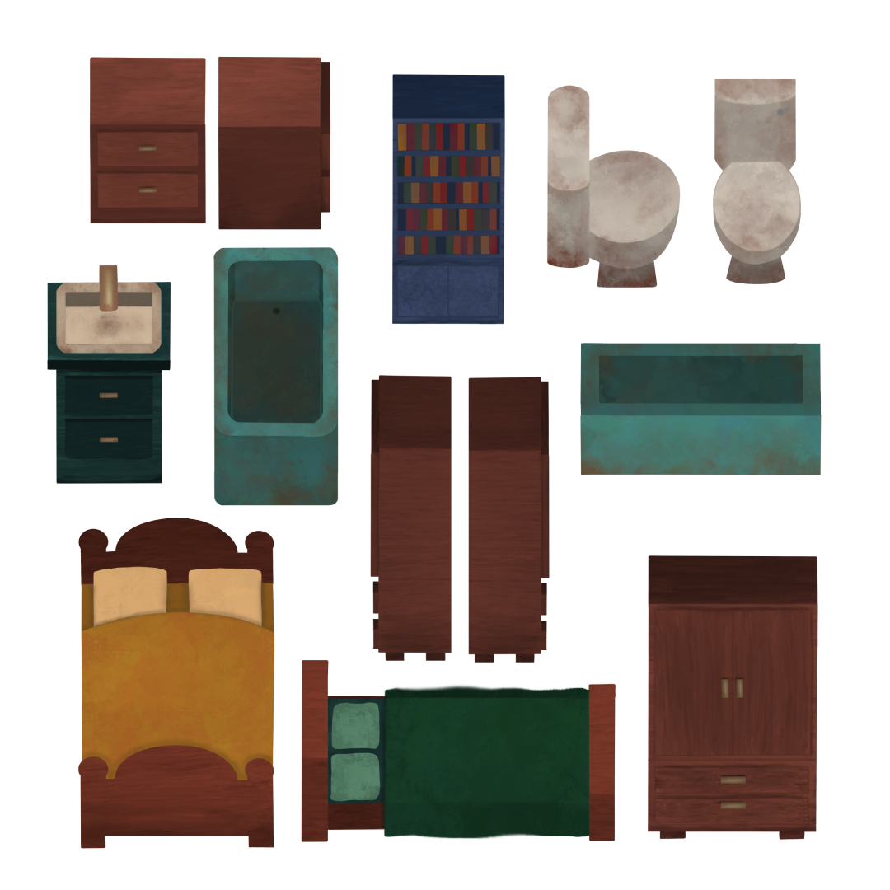

# Mejoras The Last Candle

**Desarrolladores - Grupo 10:**
- Javier Álvarez Pérez - j.alvarezp.2020@alumnos.urjc.es - https://github.com/JavierAlper
- Lucas García Marcos - l.garciamarc.2021@alumnos.urjc.es - https://github.com/Lololeifo
- Laura García Martín - l.garciamar.2021@alumnos.urjc.es - https://github.com/laurennthx 
- Cristina González De Lope - c.gonzalezde.2022@alumnos.urjc.es - https://github.com/crisstinagl
- André Miguel Pérez Sánchez - am.perezs.2021@alumnos.urjc.es - https://github.com/andremip

**Repositorio GitHub:**
- https://github.com/Laurennthx/TheLastCandleAPIREST
- https://github.com/Laurennthx/TheLastCandle

---

## Mejoras realizadas
En este documento se detalla las mejoras realizadas sobre nuestro proyecto de prácticas para la asignatura de juegos en red: ‘The Last Candle’.

### Menú de Pausa
Se ha implementado un menú de pausa al que acceder durante el transcurso de la partida. 

### Chat 
Se ha implementado un chat en tiempo real al que se puede acceder desde el menú principal y desde la partida. 

### Selección de skins
Se ha creado una skin nueva para cada personaje haciendo uso de algunos de los diseños descartados, junto con sus animaciones. Además de una escena de selección de skin para que el jugador elija. 

### Muebles del mapa
Se han diseñado, texturizado e implementado los distintos muebles pertenecientes al mapa para dotar a la casa de más variedad, verosimilitud y narrativa. En concreto, se han diseñado muebles con un estilo gótico, utilizando tonos oscuros que combinan con las paredes y el suelo del mapa. Los muebles cuentan con detalles de desgaste o de oxidación (en el caso de los muebles del baño) para remarcar el contexto de la historia de la mansión abandonada, además de diferentes cajas de mudanza distribuidas por el mapa que dan la sensación de mudanza inacabada aportando más a la historia.

#### Escondites del mapa
Varios de los muebles diseñiados, gracias a su envergadura y distribución en las habitaciones, pueden servir de escondite a los jugadores. Esto se ha implementado haciendo uso de las capas en las que estan distribuidos los elementos del juego y su profundidad, de esta forma, los jugadores podrán pasar a través de estos muebles y quedar ocultos tras estos, dando más posibilidades a los jugadores de interaccionar con el entorno.

***Imagen de los muebles implementados***
 
 
 

## Plataformas
A continuación se encuentran los enlaces con los que acceder al juego en las plataformas públicas seleccionadas:

- Kongregate: 
- Armorgames:
- Newgrounds:
- Gamejolt:
- Itch.io: 
