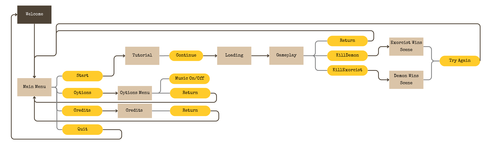
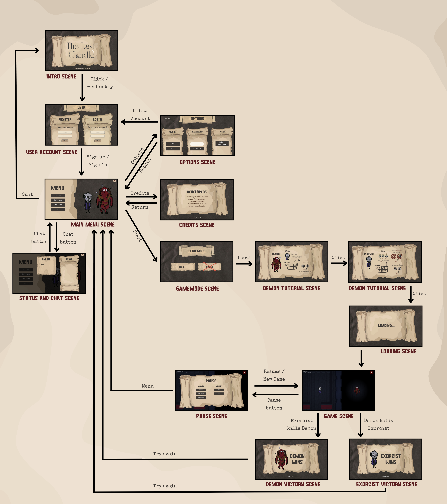
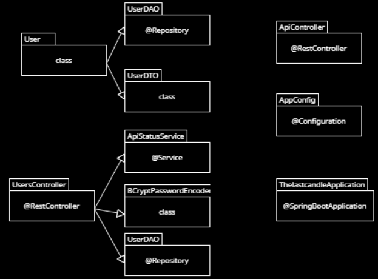

# The Last Candle

**Desarrolladores - Grupo 10:**
- Javier Álvarez Pérez - j.alvarezp.2020@alumnos.urjc.es - https://github.com/JavierAlper
- Lucas García Marcos - l.garciamarc.2021@alumnos.urjc.es - https://github.com/Lololeifo
- Laura García Martín - l.garciamar.2021@alumnos.urjc.es - https://github.com/laurennthx 
- Cristina González De Lope - c.gonzalezde.2022@alumnos.urjc.es - https://github.com/crisstinagl
- André Miguel Pérez Sánchez - am.perezs.2021@alumnos.urjc.es - https://github.com/andremip

## Introducción
En este documento se detalla la concepción de nuestro proyecto de prácticas para la asignatura de juegos en red: ‘The Last Candle’. 

## Sinopsis y Concepto
The Last Candle se enmarca en el género de terror y combina elementos de escape room con la resolución de acertijos, generando una atmósfera de tensión y misterio. La dinámica principal enfrenta a dos jugadores, cada uno con objetivos opuestos para ganar la partida. Uno de los personajes, el exorcista, deberá escapar y liberar la casa de una maldición, mientras que el otro, un demonio, intentará evitarlo, asesinando al exorcista y perpetuando su permanencia en la casa.

El argumento del juego gira en torno a dos protagonistas: un exorcista y un demonio de gran poder. El demonio ha tomado control de una casa, la cual se encuentra maldita, y el exorcista ha sido contratado para liberar la casa en nombre de un cliente. Sin embargo, al ingresar, el exorcista se percata de que está atrapado dentro de la casa. Para sobrevivir, deberá exorcizar al demonio completando un ritual que le permitirá escapar con vida. El demonio, por su parte, hará todo lo posible para impedir que el exorcista logre su misión, creando una experiencia intensa y llena de suspense.

## Historia y personajes
Una vez más, la niebla densa rodeaba la vieja mansión en la colina. Nadie recordaba quién había construido aquella casa, pero todos sabían lo que habitaba en su interior. La maldición había cobrado vida, y con ella, un demonio de poder inimaginable. Ningún alma valiente que había intentado purificarla había vuelto a salir… hasta ahora.

El exorcista fue llamado a la mansión por un cliente desesperado. Sabía que esta no sería una misión sencilla, pero lo que no imaginaba era la trampa mortal que le aguardaba. Al cruzar el umbral de la casa, las puertas se cerraron de golpe detrás de él, como si la propia mansión lo hubiera devorado. No había vuelta atrás.

Dentro, la atmósfera era opresiva, y el frío de la muerte flotaba en el aire. Voces susurraban desde las sombras, pero el exorcista sabía que no debía prestarles atención. Lo que importaba era una cosa: exorcizar al demonio que gobernaba este lugar. Sin embargo, pronto comprendió que no solo luchaba contra fuerzas oscuras, sino contra la propia casa.

El demonio, consciente de la presencia del exorcista, no se limitaba a observar desde las sombras. Con una sonrisa maliciosa, hacía que las paredes temblaran y las luces se apagaran. Se burlaba de cada paso en falso y disfrutaba al ver cómo el exorcista luchaba por su cordura, atrapado en un ciclo de caos e incertidumbre.

Pero el exorcista no estaba dispuesto a ceder. Armado no solo con oraciones y símbolos sagrados, sino con su astucia y una voluntad de hierro, comenzó a resolver los acertijos que la casa le lanzaba. Cada enigma descifrado lo acercaba más a la verdad oculta tras la maldición, pero también desataba la furia del demonio, quien redoblaba sus esfuerzos para mantener su control sobre la mansión y su prisionero.

La batalla entre los dos no era solo física, sino mental. Cada movimiento del exorcista desafiaba la autoridad del demonio, y cada trampa y juego macabro impuesto por el demonio ponía a prueba la fe y la determinación del exorcista.

Así comenzó una danza mortal entre la luz y la oscuridad, con la vida del exorcista colgando de un hilo.

## Mecánicas
### Recoger un crucifijo que aparece en un lugar aleatorio (Exorcista)
#### Objetivo
El crucifijo actúa como un ítem especial que aparece en una ubicación aleatoria tras cierto tiempo, otorgando al exorcista un "corazón extra" (aumento de vida o resistencia) cuando lo recoja. Esta mecánica aumenta la tensión, ya que el demonio también puede intentar bloquear su acceso.

#### Implementación
* **Algoritmo de aparición:** Crea un sistema que activa la aparición del crucifijo después de un tiempo específico. Usa un conjunto de puntos predefinidos distribuidos por el mapa en lugares estratégicos. El crucifijo aparecerá en uno de estos puntos de forma aleatoria.

* **Notificación al exorcista:** Cuando el crucifijo aparezca, se le puede mostrar una pista al exorcista (por ejemplo, un destello de luz en la dirección del crucifijo o un sonido sutil que aumente en intensidad al acercarse).

**Interacción del exorcista con el crucifijo**
* Al acercarse al crucifijo, aparecerá una notificación en pantalla (un ícono de interacción) para recogerlo.
* Al recogerlo, el exorcista gana un "corazón" extra (representado visualmente en su barra de vida o un aura protectora temporal). Este corazón adicional le dará una ventaja crucial al permitirle resistir un ataque adicional del demonio.

#### Feedback visual y sonoro
Cuando el exorcista recoge el crucifijo, se retroalimenta al jugador en respuesta a la acción que acaba realizar de diferentes maneras (elegiremos la más adecuada según el tiempo y los recursos). Algunos ejemplos: un brillo aparece alrededor de su personaje, sonido celestial o de campanas, indicando que ha recibido el "corazón" extra…

---

### Recoger velas escondidas por el mapa para completar el ritual (Exorcista) / Impedir que el exorcista acabe el ritual (Demonio)
#### Objetivo
El exorcista necesita encontrar las velas repartidas por el mapa y colocarlas en los distintos símbolos del ritual que se encuentran repartidos por la casa, para poder iniciarlo y así ganar la partida. El demonio tendrá que buscar y dar caza al exorcista antes de que complete el ritual.

#### Implementación
**Distribución de las velas**
* Las velas están ocultas en diferentes habitaciones o puntos estratégicos del mapa.
* Por cada vela hay un símbolo del ritual, siendo el requisito para completar el exorcismo colocar un número de velas de las disponibles (por ejemplo, si hay 5 velas para iniciar el ritual habrá colocar 4 de estas).
* Cada vez que el exorcista encuentra una vela, deberá llevarla a uno de los símbolos del ritual que se encuentran distribuidos por laa habitaciones de la casa.

**Mecánica de Tiempo Limitado**
* Para añadir más presión, una vez que el exorcista encuentra la primera vela, se puede activar una cuenta regresiva (por ejemplo, 5 minutos) durante la cual debe recoger todas las velas antes de que se apaguen.
* El demonio puede interactuar con las velas ya encendidas por el exorcista, apagándolas. Esto obligará al exorcista a volver a encenderlas y perder tiempo.

**Retroalimentación visual y auditiva**

Cada vez que el exorcista recoge o enciende una vela, puede sonar una música de fondo más intensa o generar una pequeña animación de luz. Si el demonio apaga una vela, se puede producir un sonido siniestro. De nuevo, elegiremos el tipo de retroalimentación en base al tiempo y los recursos que dispongamos.

---

### Encender y apagar la luz de la casa usando interruptores de las paredes
#### Objetivo
La mecánica de control de luz crea un contraste interesante entre los dos personajes: el exorcista necesita luz para ver el entorno completo, mientras que el demonio se beneficia de la oscuridad. Cuando el estado de la luz perjudique a un personaje, ese personaje tendrá una visión limitada favoreciendo la tensión del gameplay.

#### Implementación
**Sistema de interruptores**
* Los interruptores de luz están distribuidos por la casa en puntos clave (cerca de las entradas de las habitaciones, en pasillos largos, etc.).
* Ambos personajes pueden interactuar con los interruptores para encender o apagar la luz de la mansión y así aumentar su campo de visión y reducir la del oponente.
* Tras interactuar con los interruptores, tendrán un cooldown de unos 3s para poder volver a cambiar el estado de la luz.

**Visibilidad reducida**
* Cuando el estado de las luces perjudique a un personaje, su campo de visión quedará limitado a un área pequeña a su alrededor. En el caso de que las luces les favorezcan, tendrán una visión clara de la zona.
* La visión del exorcista se reduce drásticamente en la oscuridad, haciéndolo más vulnerable a trampas o ataques sorpresa del demonio.
* Por el contrario, el demonio tiene mejor visión en la oscuridad, dándole una ventaja táctica cuando las luces están apagadas. 

#### Estrategia de juego
Al encender o apagar los interruptores, la luz de la mansión se enciende o se apaga. Ambos jugadores deben activar un interruptor cuando su campo de visión esté reducido para así moverse con más facilidad por el mapa. Esto hace que cada 3 segundos (el cooldown de los interruptores) uno de los dos jugadores quiera ir urgentemente a cambiar el estado de las luces. El exorcista quiere tener las luces encendidas para encontrar las velas que hay repartidas por la mansión, y el demonio quiere apagar las luces para acechar con mayor facilidad al exorcsita.

## Controles
Mientras que ambos personajes pueden moverse libremente por el espacio, cada uno puede llevar a cabos sus propias acciones al pulsar el botón de interactuar. Ambos tienen acciones relacionadas, como encender o apagar las velas y los interruptores y otras acciones descritas en las mecánicas. Sin embargo, el demonio también puede atacar al exorcista si está lo suficientemente cerca, causándole daño y dándole un instante para huir si le queda más de un corazón.

**Controles en modo local:**
* Jugador 1: "WASD" para moverse por el espacio y la "E" para el resto de interacciones.
* Jugador 2: FLECHAS del teclado para moverse y el "ENTER" para el resto de interacciones.

**Controles en modo online:** ambos jugadores tendrán los mismos controles, siendo estos WASD para moverse y la "E" para el resto de interacciones.

## Niveles y misiones
En este juego, no existen niveles convencionales (como nivel 1, nivel 2, etc.). En lugar de progresar a través de múltiples fases, toda la acción tiene lugar en una casa encantada. El jugador deberá completar la partida en esta misma pantalla, que funciona a modo de "escape room." El objetivo es resolver los acertijos y evitar ser atrapado por el demonio, o bien morir en el proceso. No hay transición a otros niveles, sólo el éxito al escapar o el fracaso al ser eliminado.
El juego se va a desarrollar en una única planta (más concretamente en la planta baja de una casa encantada) con diferentes habitaciones, escondites, acertijos y obstáculos. El exorcista y el demonio comenzarán la partida en una sala aleatoria, pero alejados el uno del otro. Se podrá distinguir la habitación principal, en la cual el exorcista deberá de reunir y colocar correctamente las velas pertenecientes al ritual. Además, en dicha estancia el demonio tendrá prohibida la entrada. El juego finalizará cuando el exorcista haya completado el ritual y haya matado al demonio, o, si por el contrario, el demonio encuentra al exorcista y acaba con su vida. 

* **Misión del exorcista:** deberá recoger cinco de las velas repartidas por la casa encantada, de la forma más sigilosa posible, para realizar el ritual satánico y lograr escapar de la casa acabando con el demonio. Para poder recoger algunas de las velas, tendrá que resolver los acertijos o puzzles planteados. Durante su travesía por la planta, deberá evitar hacer ruido al interactuar con los distintos objetos, ya que esto llamará la atención del demonio y tendrá más información de su localización para acudir en su búsqueda.

* **Misión del demonio:** deberá impedir que el exorcista recoja las velas, ya sea llevando a cabo persecuciones en las que podrá dañar su vida o situando trampas. También podrá apagar las velas, perjudicando la visión del exorcista al reducir la iluminación. Su misión principal es intentar matar al exorcista antes de que logre colocar las cinco velas, finalizando el ritual y acabando con su vida.

## Apartado Artístico

### Estilo visual y referencias
El videojuego presentará un estilo 2D con perspectiva top-down, usada por videojuegos como Among Us, lo cual permitirá al jugador obtener una visión clara y estratégica del entorno. Esta perspectiva será clave para facilitar la correcta exploración, un elemento esencial para la experiencia de juego que proponemos, donde la tensión entre el asesino y el superviviente es constante.

El objetivo visual es crear una ambientación lúgubre y tenebrosa, evocando sensaciones de inquietud y peligro. Para lograr esto, tanto los escenarios como los personajes adoptarán una estética creepy inspirada en el cine de terror clásico y slasher, con influencias directas de películas como Viernes 13, Halloween y Pesadilla en Elm Street. 

Se empleará un estilo cartoon con toques góticos y gore, en línea con el estilo visual visto en videojuegos como Cult of the Lamb o Don't Starve Together, que mezclan lo macabro con lo caricaturesco. También se tomará inspiración del universo visual de Tim Burton y las ilustraciones de Benjamin Lacombe, caracterizadas por personajes de formas angulosas, ojos grandes y una estética visualmente atractiva pero perturbadora. 

La paleta de colores será predominantemente fría, con énfasis en tonos oscuros, azules y grises que potenciarán la atmósfera nocturna e inquietante del juego. Las sombras jugarán un papel crucial en la creación de una sensación de desorientación y peligro constante, contribuyendo al sentimiento de estar siendo acechado.

La iluminación será usada de manera estratégica, con momentos de luz artificial que generarán fuertes contrastes con el entorno. Estas zonas iluminadas resaltarán áreas “seguras” dentro de un escenario mayormente oscuro, acentuando la sensación de vulnerabilidad del jugador y creando un ambiente de tensión y misterio. 

En resumen, el apartado visual se centrará en construir un mundo donde el miedo y la tensión se vivan a través de una estética cartoon-gótica, con influencias tanto del cine como de los videojuegos de terror que logran mezclar lo macabro con lo estilizado.

* ***Referencias temáticas y atmosféricas:***

 ***Imagen promocional de Halloween película dirigida por John Carpenter***
 
 

 ***Imagen de El Exorcista película dirigida por William Friedkin***
 
 

 ***Imagen promocional del videojuego Dead By Daylight de Behaviour Interactive***
 
 

 ***Imagen promocional del videojuego Friday The 13th The Game de IIIFonic***
 
 

* ***Referencias estéticas:***

 ***Imagen del videojuego Don't Starve Together de Klei Entertainment***
 
 
 
 ***Imagen del videojuego Cult of the Lamb de Massive Monster***
 
 

 ***Imagen del videojuego Among Us de Innersloth***
 
 

 ***Diferentes bocetos por el director de cine Tim Burton***
 
 

 ***Ilustración de Benjamin Lacombe para la edición de Edelvives del libro Cuentos Macabros por Edgar Allan Poe***
 
 
 

### Interfaz de usuario
Para implementar las interfaces de este juego de escape room multijugador, es clave que el diseño sea intuitivo, atmosférico y funcional, permitiendo a los jugadores centrarse en sus objetivos y sentir la tensión del entorno.

#### Pantalla de Inicio / Menú principal
Título del juego en el centro, con efectos de niebla y sombras para crear un ambiente inquietante.
Opciones de Menú: "Jugar", "Opciones", "Créditos", "Salir". Al seleccionar "Jugar", se podrá elegir entre jugar como el exorcista o el demonio. Si ambos jugadores escogen el mismo rol, el juego les asignará los roles al azar. Tras ello se les mostrará un recordatorio de los controles de movimiento e interacción.

#### Interfaz Personajes
Minimalista pero funcional: Permite tener acceso rápido a su inventario y visualidad la barra de salud o corazones.
Barra de estrés/salud: En la esquina superior izquierda, una barra con el nivel de estrés, con efectos en la pantalla a medida que el estrés aumenta.
Inventario rápido: Una fila horizontal en la parte inferior de la pantalla que muestra los objetos recogidos (velas, crucifijos). 

### Apartado Sonoro
El diseño de la música y los efectos de sonido juegan un papel fundamental en los videojuegos de terror. No solo sirven como retroalimentación, sino que poseen un gran lugar a la hora de conseguir la atmósfera terrorífica y la inmersión del jugador. 
Se buscará una música de ambiente que infunda misterio, así cómo momentos de silencio que aumenten la tensión del jugador. Contaremos con diversos efectos de sonido como chirridos, sonido del viento, interruptores (para las mecánicas de la luz), pisadas…

#### Advertencia de cercanía del demonio
El exorcista podrá escuchar un sonido cuando el demonio esté cerca. Este sonido es de tipo “mono” para no revelarle desde donde se acerca el demonio y se hará más intenso según se acerca más hacia él. Esto aporta tensión al jugador y le dará la ventaja de poder esconderse al detectar que el demonio se acerca.
Esta advertencia no siempre sonará a la misma intensidad. Si el demonio deja de moverse y se queda quieto durante varios segundos, el volumen de la advertencia se reducirá y hará creer al exorcista que se encuentra lejos del peligro aunque en realidad lo tenga al lado.

#### Música y sonido del menú
El menú contará con su propia música, pudiendo cada pantalla tener una melodía diferente. Además, el sistema emitirá un sonido cada vez que el jugador presione un botón del menú.

#### Efectos principales
 Aquellos íntimamente relacionados con las mecánicas:
 * Vela encendiéndose.
 * Interruptores.
 * Coger objeto.
 * Sonido que emite el crucifijo para que el jugador lo encuentre.
 * Obtención del crucifijo.
 * Ataque del demonio y daño recibido.
 * Ritual activado

## Estrategia de mercado
### Público objetivo
El juego se encuentra dirigido a jugadores a partir de dieciséis años. Pese a que los gráficos contarán con una estética “cartoon”, el género en el que se encuentra, es decir, el terror, atrae a jugadores de edades más altas, los cuales disfrutan del suspense propio del mismo. 

A su vez, se podría encasillar en un PEGI 16. Esto es debido a la violencia presente en las interacciones entre el demonio y el exorcista, así como la alta tensión en determinadas ocasiones dentro del “gameplay”, destacando en esta última la poca iluminación, sumada a la dificultad y rapidez con la que tendrá que actuar el jugador si quiere permanecer vivo.

El propósito del juego es el entretenimiento. Los aspectos comentados proporcionarán un gran interés en el juego proveniente de jugadores experimentados en el género, dado que tiene aspectos similares a grandes videojuegos como “Don't Starve Together” o “Dead by Daylight”, entre otros.

### Tecnología y plataforma
Su desarrollo se diseñará e implementará mediante JavaScript y contará con una licencia open source, concretamente, “Apache 2”. 

El juego estará diseñado para ejecutarse en el navegador, a través de una red de ordenadores que cuenten con el sistema operativo de Windows.

### Modelo de negocio
Se ha decidido que el juego cuente con un modelo de negocio mixto. Se implementarán anuncios dentro del mismo, en algunos casos haciendo que el jugador obtenga beneficios al verlos, propio de un modelo de negocio “adware”. Además, se utilizará el modelo de negocio “freemium”, ya que se ofrecerá contenido adicional para la personalización de los personajes y/o accesorios. Por último, se encontrará disponible la opción de donación para aquellos que decidan apoyar el desarrollo del videojuego, implementando así un modelo de negocio “donationware”.

# Fase 2

## Implementación y arte
Se han realizado ciertos cambios, entre ellos, el intercambio de teclas para interactuar con los objetos, sustituyendo al “espacio” por la tecla “E”. Se ha incluido en el apartado correspondiente la licencia con la que se encuentra realizado el trabajo. A su vez, en lugar de tener que colocar cinco velas, el exorcista tendrá que colocar tres velas, una en cada ritual, para así ganar al demonio.

### Mecánicas
#### Recoger un crucifijo que aparece en un lugar aleatorio (Exorcista)
Para recoger el crucifijo lo único que hay que hacer es pasar por encima de él, haciendo que su collider y el del jugador choquen, recibiendo así el jugador un corazón más para el resto de la partida (por lo que podrá recibir un hit más del demonio).

#### Recoger velas escondidas por el mapa para completar el ritual (Exorcista) / Impedir que el exorcista acabe el ritual (Demonio)
Para poder recoger las velas situadas aleatoriamente por el mapa hay que acercarse al objeto y pulsar la “E”. El exorcista tendrá que colocar (con la misma tecla: “E”) las 3 velas, cada una en un ritual distinto llegando a completar 3 de ellos y así ganar la partida. Por el contrario, el demonio deberá impedir que el exorcista los complete y quitarle todas las vidas para poder ganar la partida.

#### Encender y apagar la luz de la casa usando interruptores de las paredes
Para que el exorcista pueda tener más campo de visión en el juego y, por lo tanto, ver un zona más grande del mapa, tendrá que pulsar la tecla “E” al llegar a un interruptor colocado aleatoriamente en la pared. Por otra parte, el demonio podrá hacer lo mismo para poder tener más campo de visión en el juego, perjudicándose el uno al otro.
Los interruptores tendrán un cooldown de unos segundos para volver a pulsarlos y se notificará al jugador con un efecto visual.

### Iluminación
En la mecánica de las luces y los interruptores se han utilizado las luces de Phaser 3 junto con imágenes con transparencias. Para simular el campo de visión de los jugadores con visión reducida, se diseñó una imagen PNG con un gradiente circular que comienza transparente en el centro y se oscurece hacia el exterior. Este gradiente genera un efecto viñeta en las cámaras de los jugadores. Aunque Phaser 3 incluye un efecto viñeta que puede aplicarse a las cámaras, no fue posible usarlo en este caso debido a que las cámaras no tienen dimensiones cuadradas, lo que resultaba en una viñeta no circular.

Cuando la visión de los jugadores es buena debido al estado de la luz de la mansión, la imagen PNG se escala hacia un tamaño mayor, ampliando su campo de visión. Por el contrario, si la visión disminuye, la imagen se reduce, reduciendo el campo visual.

Respecto a los indicadores de los interruptores se usaron las luces integradas en Phaser 3. Se pusieron luces en cada interruptor que se iluminan cuando estos dejan de estar en cooldown, ayudando a los jugadores con visión reducida a localizarlos e interactuar con ellos. Estas luces indicadoras son visibles únicamente cuando la visión de los jugadores está reducida y los interruptores no están en cooldown, siendo las del exorcista de color azul y las del demonio naranjas.

Por último, se empleó otra luz de Phaser 3 para simular el aura que rodea al exorcista cuando recoge el crucifijo. Esta luz sigue la posición del personaje mientras conserva los efectos del crucifijo.

### Música y efectos
Se ha implementado la opción de elegir entre activar o desactivar una música de fondo, elegido por sus características, propias de los juegos de terror, que aporta una sensación inmersiva al jugador.
A su vez, se han implementado efectos de sonido al interactuar con los botones de la interfaz, tanto en la interacción de pulsarlos como al mantener el ratón por encima. 
También existen efectos de sonido durante el juego, cuando el exorcista interactua con las velas, rituales y crucifijo, así como cuando ambos interactuan con los interuptores.

### Diseño del logotipo

### Diseño de personajes
#### Exorcista

##### Bocetos y Diseño final

##### Animaciones
  

#### Demonio

##### Bocetos y Diseño final

##### Animaciones
  

### Diseño del mapa
#### Boceto y Final

#### Texturas

### Decoraciones
Estas decoraciones aún no han sido implementadas pero se han probado en el juego y se van a realizar cambios en ellas de cara a las siguientes entregas.
La mansión encantada se encontrará decorada con varias cajas de mudanza, que, a su vez, tendrán una doble función de “escondite” para aquel jugador que tome el control del exorcista. Además, se han comenzado a diseñar los futuros muebles que se ubicarán en las distintas habitaciones, aunque se verán modificados según las necesidades de la estética de esta. Gran parte de dicho mobiliario contará con la doble función de “escondite”.

### Objetos
Se han diseñado cuatro objetos interactuables, cuyas funciones se han desarrollado en los apartados previos. En concreto son las velas, los interruptores, las estrellas de los rituales y el crucifijo. Varios de ellos cuentan con dos versiones distintas según la variación que ofrecen.
 
  

### Interfaces
El diseño de las interfaces se ha realizado siguiendo la estética del videojuego propuesto, una estética gótico-estilizada. Se han implementado en total nueve interfaces, sumándole la interfaz del juego que cuenta con un “divider” vertical en el centro de la pantalla. Entre ellas, podemos encontrar los siguientes diseños:

 ***Diagrama***

 ***Pantalla Inicio***

  Pantalla en la que se comienza al iniciar "The Last Candle". Solo permite una interacción, pulsar cualquier tecla para avanzar a la pantalla principal.

 ***Pantalla Menu Principal***

La pantalla principal del videojuego que muestra a los dos protagonistas, desde ella se puede acceder a las pantallas de juego, opciones y créditos. Además, se puede volver a la pantalla inicial desde "quit".

 ***Pantalla de Opciones***
 
 En ella, se le permite al jugador activar o desactivar la música del juego. Además, muestra los controles básicos de movimiento de ambos jugadores. Cuenta con la opción de "return" para volver al menú principal.

 ***Pantalla de Créditos***
 
 En ella, se muestran los integrantes que han desarrollado el trabajo. Solo cuenta con una opción de "return" para volver al menú principal.
  

 ***Tutorial del exorcista***
  
  Se ha creado un breve tutorial visual sobre la misión del exorcista y los controles para llevarla a cabo. Al presionar cualquier tecla se avanza a la pantalla de carga.

 ***Tutorial del demonio***
   
   Se ha creado un breve tutorial visual sobre la misión del demonio y los controles para llevarla a cabo. Al presionar cualquier tecla se avanza a la pantalla de carga.

 ***Pantalla de carga***
  
  Pantalla creada para amenizar la espera mientras se cargan los recursos del juego, no es interactuable.

 ***Pantalla de juego***

  Una pantalla que muestra un "divider" para separar a ambos jugadores. En ella, se muestran el número de velas que posee el exorcista y el número de rituales que ha completado. También, cuenta con una opción de "return" para volver al menú principal.

 

 ***Victoria del exorcista***

  Pantalla para mostrar que el exorcista ha llevado a cabo su misión y ha acabado con el demonio. Desde esta se puede volver al menú principal mediante "Try Again".

 ***Victoria del demonio***

  Pantalla para mostrar que el demonio ha llevado a cabo su misión y ha acabado con el exorcista antes de que complete sus rituales. Desde esta se puede volver al menú principal mediante "Try Again".

# FASE 3: API REST

En esta tercera fase se ha implementado la comunicación entre el cliente y el servidor empleando el servicio REST.  

En esta implementación se puede crear una lista de cuentas de distintos usuarios, la cual se serializa y deserializa según la función que se realice sobre ella. Cada usuario, a su vez, se almacenará con un nombre, una contraseña codificada y el número de victorias obtenidas. 

## Diagrama de navegación

A continuación, se muestra actualizado el diagrama de las interfaces que componen el videojuego:

## Diagrama de clases 

A continuación, se muestran las relaciones entre las distintas clases que forman el proyecto:

### Compilación
Explicacion .jar

